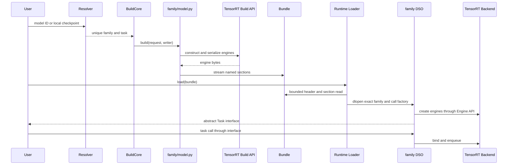
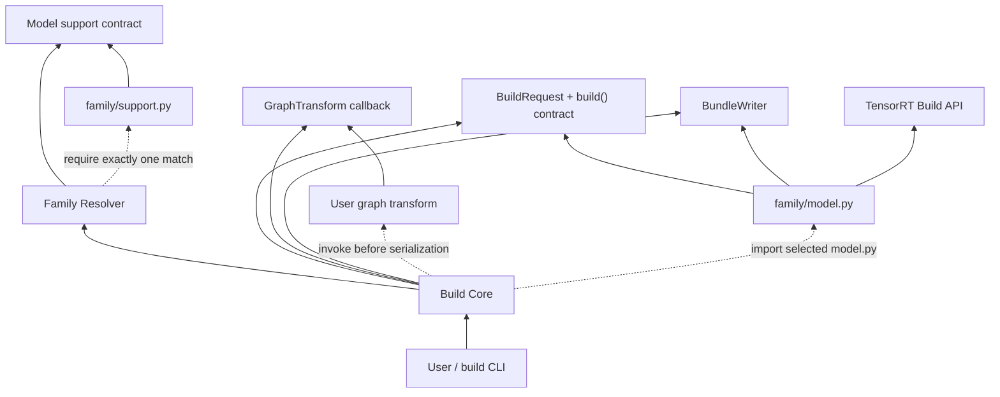
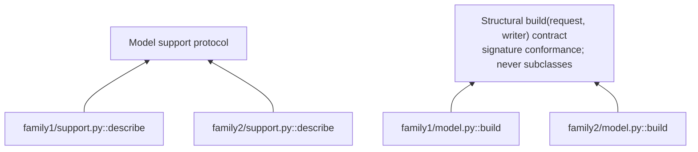
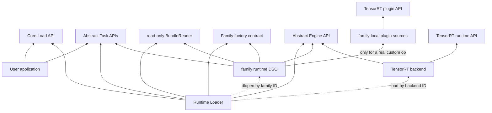
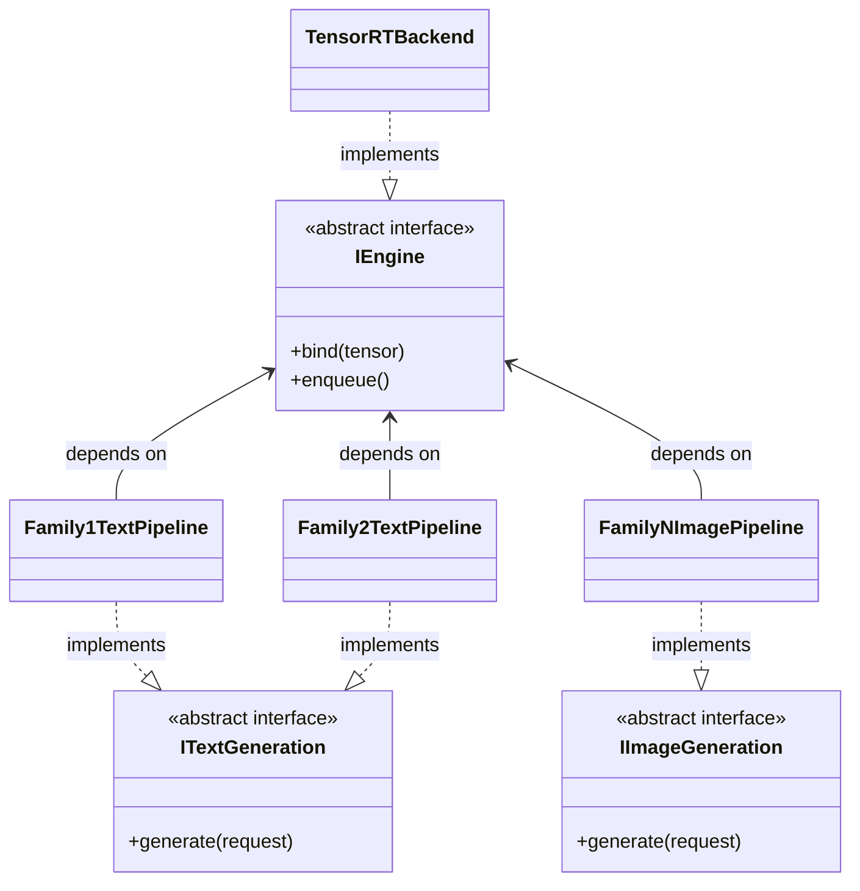
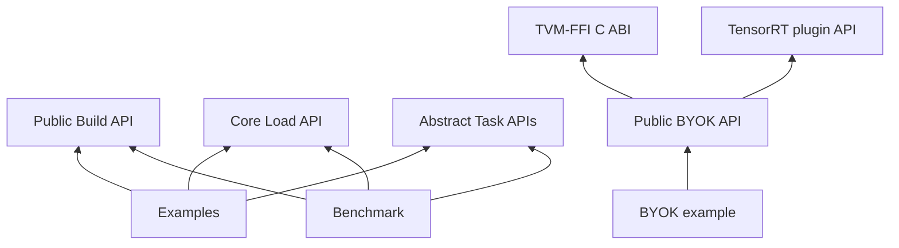

Status: current repository architecture and single-PR completion contract.

## One-sentence decision

The shared core owns only discovery, loading, bounded container mechanics,
stable abstract interfaces, and control transfer. Each model family owns its
checkpoint identities, supported tasks, TensorRT build, bundle content, native
pipeline, dispatch, bindings, preprocessing, postprocessing, and tests.

Adding a normal family must not require changes to core, another family, a
central registry, or a central source list. One team or agent must be able to
add and revert a family without understanding or coordinating with sibling
families.

"Horizontal scaling" refers to source ownership and independent development.
It does not claim that CI capacity, GPU capacity, or serving throughput has no
physical limit.

## Design goals

1. A family is a complete vertical slice, not a thin adapter around a shared
   model framework.
2. Discovery imports only dependency-free family `support.py` modules. The
   build imports only the selected family `model.py`; runtime loads only the
   selected family DSO.
3. Families have no source dependency on each other. Similar implementation
   may be copied until a real stable contract proves a shared boundary.
4. Build and runtime exchange model state only through a bundle.
5. User applications depend on stable Task APIs, not family or TensorRT
   implementation details.
6. A minimal real end-to-end path must work before additional families or
   abstractions are added.
7. Python family builders are plain functions. Builder inheritance is
   forbidden.
8. Examples, benchmarks, and BYOK are applications over public APIs. Core,
   backend, and families do not depend on application code.

## Delivery constraints

This architecture replaces the old project atomically in one pull request:

- All supported families, build paths, runtime paths, bundles, and tests move
  to the new architecture in the same PR.
- The final PR contains only the new architecture. Retired registries, source
  lists, APIs, bundle readers, profiles, and tests are deleted.
- There is no backward-compatibility flag, adapter, shim, fallback, dual path,
  deprecated alias, or migration layer.
- A partially migrated tree is not a valid final PR state.
- Local development may be temporarily incomplete, but every final commit and
  the final PR head must satisfy the complete new contract.

The project has no external compatibility promise that justifies retaining
the old architecture. Simplicity of the current design takes priority over
keeping an obsolete path alive.

## Non-goals

This refactor does not introduce:

- a generic model IR or graph framework;
- `BuilderDriver`, `BundleSpec`, builder inheritance, or a collection of
  optional hooks;
- cross-family graph blocks, pipelines, schedulers, or test frameworks;
- a remote plugin registry, marketplace, or hot-update system;
- distributed serving, automatic scheduling, or multi-tenant isolation;
- arbitrary C++ ABI compatibility across releases;
- readers or converters for old bundles and old config schemas;
- bundle-section, source, duplicate-content, ABI, or provenance hashes;
- speculative abstractions for requirements that do not exist.

The only build hook is the concrete pre-serialization graph transform required
by the existing BYOK subgraph-replacement use case.

## System overview

This sequence shows control and data flow for one build and one load. Sequence
arrows represent calls and returned data only; source dependencies are shown
separately below.



There are two model-control transfers:

1. Build core calls the single selected family `build()` function.
2. Runtime loads the family named by the bundle and calls its factory.

After each transfer, core no longer participates in model behavior.

## Seven minimal components

| Component | Owns | Explicitly does not own |
| --- | --- | --- |
| Native Core (`libtrtmc_core.so`) | bounded bundle reads, device tensors, stable engine primitives | `dlopen`, model config, weight mapping, preprocessing, request loops |
| Runtime Loader (`libtrtmc_runtime.so`) | safe family/backend names, explicit runtime root, exact `dlopen`, one control transfer | model pipelines, preprocessing, policy dispatch, family fallback |
| Family | checkpoint identity, tasks/default, graph build, weights, section semantics, native pipeline, dispatch, bindings, pre/postprocessing | sibling families, shared model policy |
| Bundle | header and named byte sections with bounded streaming I/O | model schema, section semantics, content hashes |
| Task API | user behavior such as text, image, audio, embedding, and segmentation | family names, TensorRT objects, backend details |
| Engine API | engine creation, tensor description, binding, and enqueue | tokenization, sampling, scheduling, stopping policy |
| Graph Transform / BYOK Bridge | one pre-serialization callback and an explicit TVM-FFI kernel plugin layer | graph IR, automatic region selection, hashes, registries, family policy |

## Dependency rules

All dependency diagrams use the following arrow semantics:

- `A --> B`: A has a source or build dependency on B.
- `A -.-> B`: A discovers, loads, or calls B at runtime; this is not a static
  source dependency.
- `Interface <|.. Implementation`: the implementation realizes the abstract
  interface. The hollow triangle points to the interface.

Runtime control transfer from core to a family does not permit core to import,
include, or link that concrete family.

### Build-time dependencies



Key properties:

- `support.py` realizes only the model-support contract and has no family build
  dependency.
- Resolver may import every `support.py`, but never imports an unselected
  `model.py` or its dependencies.
- Zero matches and multiple matches are errors. There is no retry or fallback.
- Family build depends on the narrow build contract, not build-core
  implementation.
- Family build is structurally conformant through its function signature; it
  does not inherit from a base class.
- No family points to another family.



### Runtime dependencies



Key properties:

- The user application depends only on public load and task contracts.
- A family DSO depends on the factory, Task, BundleReader, and Engine contracts,
  not `libtrtmc_runtime.so` implementation.
- A family pipeline drives engines through the abstract Engine API and does not
  link `libtrtmc_backend_trt.so`.
- A family whose graph uses distributed collectives owns its communicator and
  NCCL loading. A replicated plan that only selects by rank does not load NCCL.
- The backend implements the Engine API and does not depend on any family.
- A real model-specific TensorRT custom plugin may be compiled directly into
  its owner family DSO. It does not become shared backend implementation.

The loader is compiled only into `libtrtmc_runtime.so`. Family and backend DSOs
link `libtrtmc_core.so`, not the loader. CLI image and WAV file I/O remains
private under `apps/cli/`; it is not a public SDK contract.

### Task and Engine realization



Concrete pipelines implement abstract user behavior. Task APIs do not know
models, and core returns interfaces rather than concrete types. A new Task API
is justified only when a real family exposes user behavior that existing
interfaces cannot express.

### Complete dependency table

| Component | Allowed dependencies | Forbidden dependencies |
| --- | --- | --- |
| User application | Core Load API, abstract Task APIs | family implementation, BundleReader, backend details |
| Build core | standard HF identity metadata, model-support contract, family resolver, build contract, BundleWriter | concrete family implementation, family graph/weights |
| Family build | build contract, BundleWriter, TensorRT Build API | sibling family, shared model helper, runtime core, Task API |
| Runtime loader | Load API, Task APIs, BundleReader, factory contract, Engine API, Native Core, dynamic loader | concrete family/backend policy |
| Native Core | bundle container I/O, device and engine primitives | loader, CLI file I/O, family preprocessing |
| Family runtime | factory contract, Task APIs, BundleReader, Engine API, model-owned custom plugin API when needed | sibling family, loader implementation, concrete backend implementation |
| Engine backend | Engine API | family, Task behavior, model policy |
| Examples and benchmark | public build, load, Task, and BYOK APIs | family/backend private implementation, reverse core dependency |

### Application dependency is one-way



Core, families, and backend must not import, include, or link `examples/`,
`apps/benchmark/`, or the benchmark Python package.

The following dependencies are always forbidden:

```text
family A -> family B
core -> concrete family implementation
Task API -> concrete family
Engine backend -> concrete family
```

The closed shared set consists of model-support and build contracts, family
resolver/loader mechanics, bundle container I/O, Core Load API, abstract Task
and Engine APIs, stable device/engine primitives, one graph-transform callback,
and the already exercised model-agnostic BYOK bridge. Everything else remains
family-local or application-local.

## Minimal repository ownership

One family is a physical directory:

```text
families/<family>/
  __init__.py                 # docstring only
  support.py                  # exact checkpoint identity + tasks/default
  model.py                    # complete Python build entrypoint
  requirements.txt            # optional family-only dependencies
  runtime/
    CMakeLists.txt
    plugin.cpp                # factory + Task implementation
    pipeline.cpp/.h           # only when needed
    kernels/*.cu              # only when needed
  tests/
    test_e2e.py
    manifests/*.json          # cases + their checkpoint and premerge declarations
    thresholds/*.json             # optional numeric overrides only
    data/ and assets/
    cpp/*.cpp                 # optional family-native tests
```

Directory name is the connection key:

- support discovery calls `families/<family>/support.py`;
- build imports `families/<family>/model.py`;
- native library name is `libtrtmc_model_<family>.so`;
- optional dependencies come only from that family's `requirements.txt`;
- checkpoint inputs come only from that family's test manifests;
- model tests come only from that family's `tests/`;
- CI impact maps a family path only to its owner.

There is no central family map, source list, or required internal structure
beyond these boundary files. Adding a family adds one directory.

## Dependency environment

Build, reference, and E2E jobs use one trusted pinned base image. Adding or
changing a family dependency does not publish another runtime image digest.
Digest pins are limited to container base-image references. Model dependencies
and produced source, wheel, bundle, test, and report artifacts do not get a
repository-defined content digest.
The supported build environment is Python 3.12 with TensorRT 11.1; this
one-shot refactor does not retain the retired Python 3.10 or TensorRT 11.2
validation lanes.

```text
pinned base image
  + requirements/base.txt                  # minimal shared build tools
  + families/<family>/requirements.txt     # optional owner packages
  = one environment for one family job
```

Rules:

- `requirements/base.txt` contains only genuinely shared build/test tools.
- A family declares extra build, reference, or test packages in its own plain
  `requirements.txt`.
- A family with no extra dependency omits the file.
- A family manifest declares the checkpoint inputs its E2E cases need: Hub
  repositories, or external files as plain `path` and HTTPS `url` pairs. CI
  prepares only those declared inputs before the family proof goes offline.
- Every family marks at least one case `premerge: true`. Premerge runs exactly
  those owner-selected cases; nightly runs every declared case.
- Requirements do not include another family, a central lock profile, a
  fingerprint, or hashes.
- CI does not derive a source, dependency, wheelhouse, bundle, or report digest.
- One job installs only its selected family's file and never merges multiple
  family environments.
- Generic package validation checks the packaged family files and DSOs without
  importing every `model.py`; the selected family is imported only after its
  own requirements are installed.
- Shared unit jobs do not collect family tests. The one-family job installs its
  requirements, then runs that family's Python, C++, GPU, and checkpoint tests.
- The native deployed bundle does not read Python requirements or launch
  Python.

## Build control plane

### Family-owned model discovery

The user provides a Hugging Face model ID or local snapshot. The CLI downloads
the snapshot when necessary, then reads only:

- root `config.json`;
- root `model_index.json`;
- relative snapshot filenames.

The resolver enumerates `families/*/support.py`. Every support module depends
only on the shared support contract and returns either `None` or a
`FamilySupport` with supported tasks and a meaningful default.

Typical static declaration:

```python
from tensorrt_model_connect.model_support import family_support

describe = family_support(
    model_types=("gpt2",),
    architectures=("GPT2LMHeadModel",),
    tasks=("text_generation",),
    default_task="text_generation",
)
```

Matching is exact after punctuation normalization. It may use an exact
`model_type`, architecture class, Diffusers pipeline class, or a minimal set of
exact sentinel files when a supported repository has no root identity JSON.
Support may also inspect an exact family-owned root JSON shape. It does not
import TensorRT, PyTorch, Transformers, `model.py`, or another family.

The resolver has exactly three outcomes:

- zero matches: unsupported model;
- one match: resolve family and default task;
- multiple matches: ownership conflict.

There is no repository-name inference, broad prefix, substring, priority,
score, first-match selection, or fallback. The resolver imports the selected
`model.py` only after a unique owner has been established.

Task is an optional user override. If omitted, the matching family supplies a
meaningful default. If provided, it must be one of that family's supported
tasks. The resolved low-level `BuildRequest` always contains a non-empty family
and task.

### Single build entrypoint

Each family exposes one plain function:

```python
def build(request, writer):
    ...
```

- `request` contains the resolved local model path, family, task, backend,
  precision, parallel sizes, explicit shape limits, and the direct dynamic-KV
  opt-in.
- `writer` exposes header fields and streaming named sections.
- The family reads config and weights, builds TensorRT engines, and writes its
  own bundle sections.
- The family validates supported and unsupported request values explicitly.
- There is no base builder class or options bag.

### Build failure semantics

- Unsupported or ambiguous model ownership fails before importing a family
  implementation.
- An unsupported task or build dimension fails explicitly.
- Once family build begins, its exception is preserved and no other family is
  attempted.
- A failed build aborts the pending bundle and never reports it as published.

## Bundle boundary

The shared header is intentionally small:

```json
{
  "format": 1,
  "family": "gpt2",
  "task": "text_generation",
  "backend": "trt"
}
```

The container additionally stores section name, offset, and length. A family
owns section names, order, schema, and semantics. `BundleWriter` supports
streaming large sections without requiring another complete host copy.

The runtime creates a bounded, read-only `BundleReader` and transfers it to the
selected family factory. A pipeline that needs deferred section loading copies
the reader value; it does not retain a factory-context reference.

Core validates only what is required for safe reads and dispatch:

- current integer format;
- bounded section offset and length without overflow;
- safe non-empty family, task, and backend identifiers.

Core does not compute section hashes. Filesystem or transport owns file
integrity, backend owns engine deserialization, and family owns config validity.
Old bundle formats and translation tools are not supported.

## Runtime data plane

Runtime dispatch occurs once:

1. The user calls `load(bundle)`.
2. Runtime reads the fixed header and bounded section table.
3. Runtime derives and loads `libtrtmc_model_<family>.so` from the explicit
   runtime root.
4. Runtime finds the fixed family-factory symbol and passes BundleReader,
   Engine API, and the direct runtime KV budget. Backend-only RTX cache and
   whole-graph options are applied through the Engine API wrapper.
5. Family creates engines, bindings, and a concrete task pipeline.
6. Runtime returns the abstract Task interface. Later requests call the family
   pipeline directly.

Core, family, and backend DSOs are produced by one product build. There is no
ABI negotiation, version translation, old-symbol alias, or compatibility shim.

### Task API

Tasks are user behaviors rather than model names, for example:

```text
TextGeneration::generate(...)
ImageGeneration::generate(...)
SpeechRecognition::transcribe(...)
Embedding::embed(...)
```

Bundle `task` is the primary task identity, not a capability whitelist. A
family may implement multiple real Task interfaces. Applications request and
cast the interface they need; core does not run another model/task switch per
request.

### Engine API

Engine API is the only boundary between a family pipeline and a concrete
TensorRT runtime. It supports engine creation from bundle sections, tensor
query, buffer binding, and enqueue. Family controls engine order, binding
meaning, output interpretation, scheduling, and model behavior.

### BYOK and graph transform

Model-specific custom TensorRT plugins belong to their family. The single
model-agnostic exception is the explicit BYOK bridge:

- `add_kernel()` inserts an explicitly named TVM-FFI plugin layer with explicit
  input and output contracts;
- the application loads the matching DSO and function before bundle load;
- `BuildRequest.graph_transform` may receive the live TensorRT network before
  serialization, add a replacement layer, and reconnect selected consumers;
- the callback runs only at build time, and runtime never launches Python.

The bridge does not search graphs, guess regions, generate hashes, maintain a
kernel registry, or depend on examples.

## Why this scales horizontally

| Common conflict source | Resolution |
| --- | --- |
| central model switch | each `support.py` owns exact checkpoint identity |
| central Python model registry | discovery imports support only; build imports one `model.py` |
| central CMake source list | each family defines its own DSO target |
| shared model helper | keep family-local copies |
| global E2E runner/comparator | each family owns runner, reference, optional numeric thresholds, and fixtures |
| one family failure affects runtime | a process loads only the requested family DSO |

Multiple teams or agents can work in different family directories without
editing the same model source or central registration file. Faults and reverts
remain owner-local. Deliberate duplication is accepted; code similarity alone
never justifies shared model implementation.

## Minimal meaningful validation

Every family proves a real closed loop:

1. Each supported checkpoint identity resolves to exactly one family. Zero or
   multiple matches fail.
2. Discovery imports no family implementation; build imports only the selected
   `model.py` and produces a readable bundle.
3. Runtime still loads a family when sibling family DSOs are absent.
4. Family creates real engines, binds tensors, and executes a real Task call.
5. Output meets family-owned correctness criteria.

Each family owns its effective correctness contract. A case uses direct
official-reference parity only when that family contract declares it; other
cases may use task-level, artifact, or runtime invariants. There is no generic
fallback comparator or repository-wide visual threshold set.

Core tests only shared boundaries: discovery uniqueness, container bounds,
safe DSO path derivation, factory loading, and error propagation.

Do not add tests that:

- hash source files or bundle sections;
- require similar family files to remain byte-identical;
- lower correctness thresholds to make CI pass;
- reimplement TensorRT engine validation in a unit test;
- enforce metadata unrelated to user-visible behavior.

## Single-PR completion standard

The PR is complete only when all conditions below hold.

### Architecture replacement is complete

- Every supported family has its own support, build, runtime, and tests.
- Every family uses the same minimal structural build contract.
- Every runtime family produces an independent DSO implementing abstract Task
  APIs without linking sibling families.
- Discovery imports dependency-free support modules; build imports one selected
  implementation; runtime loads one selected family.
- Adding structurally different families does not add model logic to core.

### Retired architecture is gone

- Old builder orchestration, base builders, shared model helpers, registries,
  strategy switches, and central model source lists are deleted.
- Old APIs, bundle readers/writers, schemas, deprecated aliases, and tests are
  deleted.
- No compatibility layer, adapter, shim, dual path, fallback, legacy branch,
  or migration tool remains.
- Documentation, examples, CLI, and tests describe only the new architecture.
- BYOK, benchmark, Cosmos3 dual-Spark, and VoiceChat full-duplex applications
  use the new public boundaries.

### Shared infrastructure remains thin

- Shared code contains only model-support/build contracts, resolver/loader
  mechanics, bundle I/O, public load/task/engine contracts, stable device
  primitives, the single graph-transform callback, and the exercised BYOK
  bridge.
- Shared code reads only standard identity JSON and relative snapshot filenames;
  it does not interpret family config, tokenizer, weights, graph, quantization,
  cache, scheduler, bindings, preprocessing, or model tests.
- Family A never imports, includes, links, or reads family B files.
- Optional family dependencies live only in owner `requirements.txt` files.
- CI pins one base image digest and installs only the selected family's
  declared dependencies.
- Core and families do not depend on examples or benchmark applications.
- No shared helper is introduced only to reduce duplicated lines.

### Behavior is closed end to end

- BundleWriter streams large sections.
- Header exposes family, task, and backend directly.
- Every family creates engines, binds tensors, and passes its real E2E standard.
- A family works without sibling DSOs.
- User application performs real inference through Core Load and abstract Task
  APIs only.
- BYOK DSO, benchmark worker, dataset benchmark, and hardware examples receive
  validation appropriate to their available hardware boundary.
- Full build, unit tests, every selected family E2E, examples, benchmark,
  documentation, and source-quality checks pass.

A one- or two-family smoke is a local milestone, not final PR completion. The
PR is incomplete while any old family, entrypoint, or fallback remains.

## Local implementation order inside the same PR

1. Delete central abstractions and fallbacks that would force compatibility.
2. Implement only the thinnest support resolver, loader, bundle I/O, Task API,
   and Engine API.
3. Use one simple real family to prove:

   ```text
   checkpoint -> support resolution -> build() -> bundle
              -> dlopen family DSO -> Task API -> real output
   ```

4. Before that smoke passes, do not add a second family, extension points,
   shared model helpers, or additional config layers.
5. After it passes, migrate the remaining families independently and copy
   similar implementation when necessary.
6. For every family, run its own build/runtime E2E and verify independence from
   sibling DSOs.
7. After all families are migrated, delete remaining retired files, tests,
   documentation, and unreachable entrypoints, then run repository-wide
   validation.
8. Submit the PR for review only after the complete single-PR standard is met.

Do not introduce speculative abstraction, compatibility, migration, registry,
cache, or validation systems during this process.
