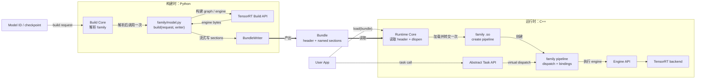
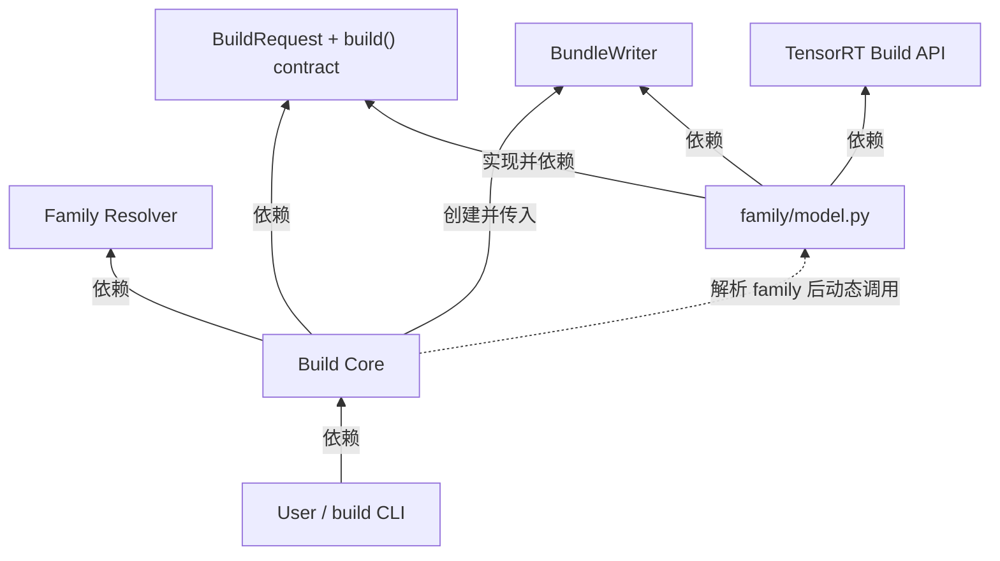
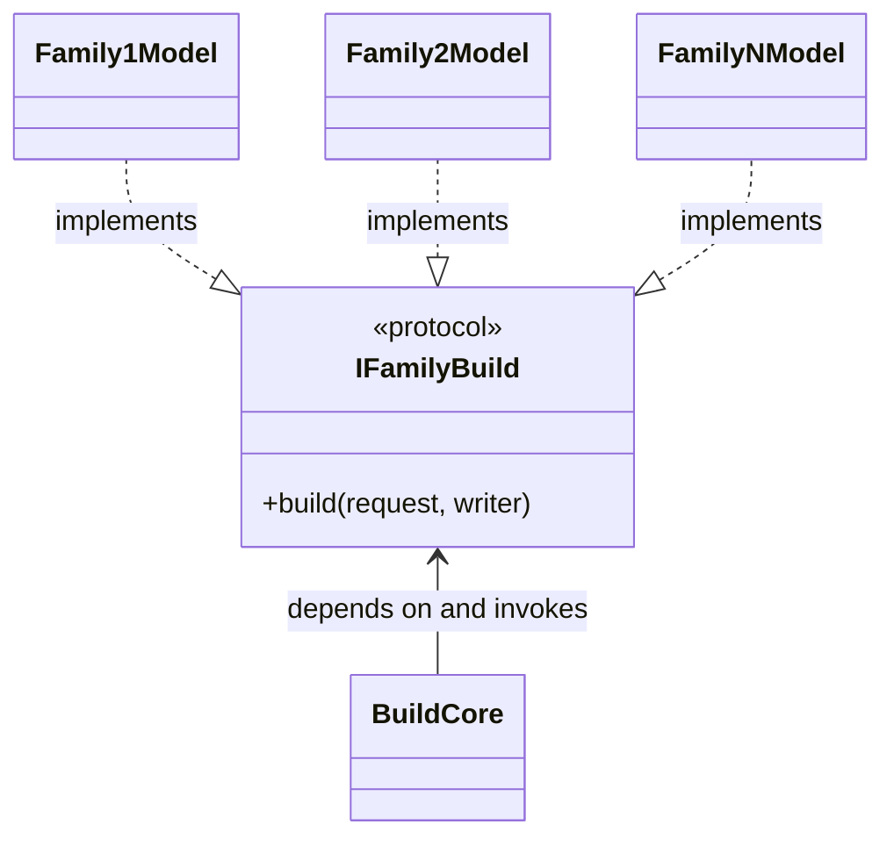
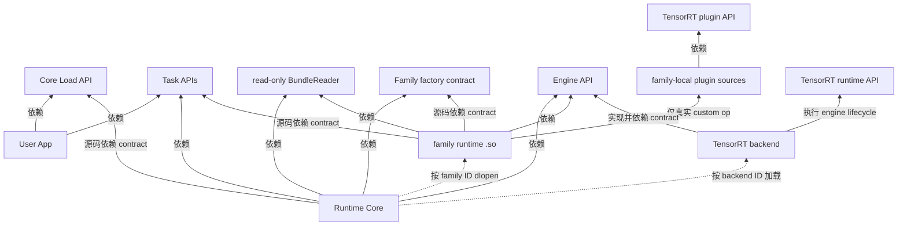
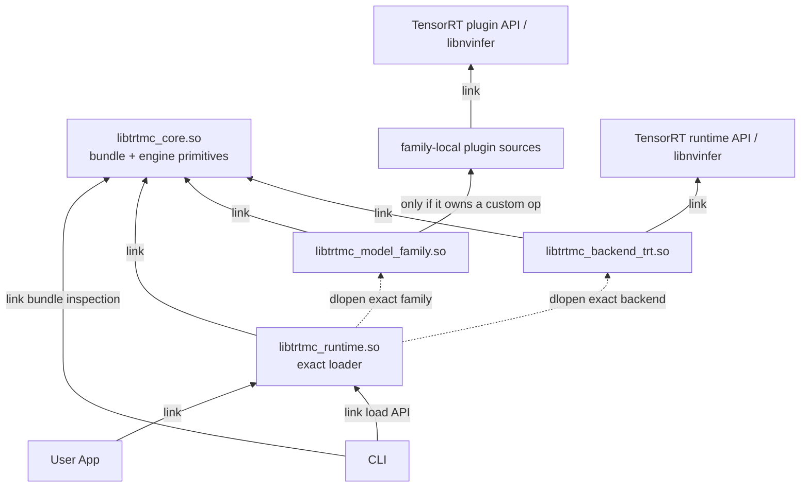
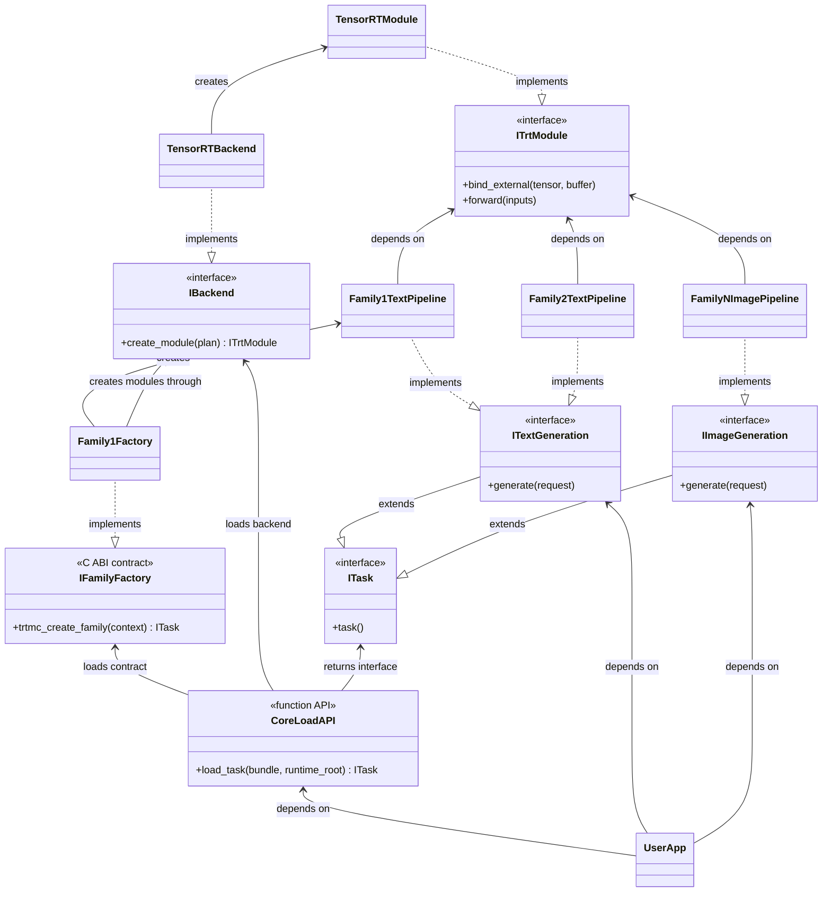

状态：本仓库的现行架构与单 PR 完成标准。

## 一句话决策

`core` 只负责发现、加载、基础合法性检查和控制转交；每个 model
family 独立拥有自己的构建逻辑、TensorRT 图、bundle 内容、运行时
pipeline、dispatch、binding 和测试。

新增一个 family 的正常路径不得修改 `core`、其他 family 或任何中心
switch/registry/source list。一个 AI agent 应当可以独立完成一个 family，
而不需要理解或协调其他 family。

“正常路径”指新 family 使用当前已经存在的用户级 Task API 和显式
`BuildRequest` 维度。只有真实的新用户任务或新的全局 build dimension 无法由
现有 contract 表达时，才修改 shared contract；这属于 contract 变更，不是
family 注册。当前字段保持封闭且有类型，不用 options bag。每个 family 必须
消费自己支持的字段，并对其余非默认值明确失败，不能静默忽略。

这里的“无限横向扩展”是指开发所有权和变更可以持续横向增加，不是指
CI、GPU 或线上吞吐量没有物理上限。

## 设计目标

1. 一个 family 是完整的纵向切片，而不是几个共享框架的薄 adapter。
2. 构建时只导入目标 family；运行时只加载目标 family 的共享库。
3. family 之间没有源码依赖。相似实现可以先复制，不能因为相似就强制共享。
4. build 和 runtime 只通过 bundle 交接，不共享模型实现。
5. 用户只依赖稳定的 Task API，不依赖 family 或 TensorRT backend。
6. 最小实现先跑通一个真实 family，再用第二个不同 family 证明边界。
7. Python family builder 禁止 class inheritance，只能使用普通函数和 composition。
8. examples、benchmark 和 BYOK 只依赖公开 build/load/Task API；core、backend
   和 family 不反向依赖应用代码。

## 交付约束

本架构通过一个 PR 原子替换整个项目：

- 所有现有 family、build、runtime、bundle 和测试路径在同一个 PR 中完成重构。
- 最终 PR 只保留新架构；旧实现、旧 API、旧 bundle reader/writer、旧 registry、
  旧 source list 和旧测试直接删除。
- 不保留 backward compatibility，不提供 compatibility flag、adapter、shim、
  fallback、dual path 或 deprecated alias。
- 不写 migration layer，也不提交“新旧都能跑”的中间架构。
- 不拆成多轮兼容 PR。PR 在全部 family 都使用新路径前不算完成。
- 本地开发过程可以暂时不完整，但最终 commit/PR 不能包含旧路径残留。

项目目前没有需要维护的外部兼容承诺，因此新架构的简单性优先于旧行为。
任何只为旧实现继续工作的代码都属于应删除代码。

## 非目标

本次重构不建设以下系统：

- 通用模型 IR 或通用 graph framework
- `BuilderDriver`、`BundleSpec`、任何 builder inheritance 或可选 hook 集合
- 跨 family 的 graph block、pipeline、scheduler 或测试框架
- 远程 plugin registry、plugin marketplace 或热更新
- 分布式 serving、自动调度或多租户隔离
- 跨 release 的任意 C++ ABI 兼容
- 旧 bundle/API/config 的读取、转换或兼容
- bundle section 哈希、源码哈希、重复内容哈希或 provenance 图
- 为未来可能出现的需求预留抽象

这些能力只有在一个真实用例无法通过现有最小边界实现时才加入。

## 系统全景：控制流和数据流

下面这张图只表示一次 build 和一次 load 的执行顺序，不表示源码依赖。
控制与数据从左向右流动。



系统只有两次关键控制转交：

1. 构建时，core 解析出 family 后调用该 family 的 `build()`。
2. 运行时，core 从 bundle 读出 family 后加载该 family 的 `.so`。

转交完成后，core 不再参与模型逻辑。请求执行期间也不重复做 family
查找或策略分发。

## 七个最小组成部分

| 组成部分 | 只负责 | 明确不负责 |
| --- | --- | --- |
| Native Core (`libtrtmc_core.so`) | bundle 有界读取、device tensor 和稳定 engine primitive | `dlopen`、模型 config、权重映射、前后处理或请求循环 |
| Runtime Loader (`libtrtmc_runtime.so`) | family/backend 名称合法性、显式 runtime root、精确 `dlopen` 和一次性控制转交 | 模型 pipeline、前后处理、策略分发或 family fallback |
| Family | 构建图、加载和变换权重、所有 TRT build 调用、bundle section 语义、运行时 pipeline、dispatch、bindings、前后处理 | 修改其他 family 或把模型策略放回 core |
| Bundle | 一个带命名 section 的容器；提供只读有界读取和流式写入 | 定义模型 schema、理解 section 内容、替 family 序列化模型数据或计算内容哈希 |
| Task API | 面向用户的 text、image、audio、embedding 等任务接口 | 暴露 family 名称、TRT 对象或 backend 细节 |
| Engine API | 反序列化 engine、描述 tensor、绑定 buffer、enqueue | tokenization、sampling、调度、停止条件或其他模型行为 |
| BYOK Bridge | 把显式 TVM-FFI function 连接到 TensorRT plugin layer | graph 搜索、region 猜测、hash/provenance 或 family 策略 |

## Dependency 规则

从这里开始，所有 dependency 图使用同一套箭头语义：

- `A --> B`：A 的源码或 build 依赖 B。
- `A -.-> B`：A 在运行时发现、加载或调用 B；这不是源码依赖。
- `Interface <|.. Implementation`：Implementation 实现 Interface；空心三角
  永远指向 abstract interface。
- 图按 `BT` 排列，让稳定的共享 contract 位于上方，依赖它们的实现位于下方。

这一区分很重要。core 在运行时调用 family，不代表 core 的源码可以 import、
include 或 link 某个 concrete family。

### Build-time dependencies



关键点：

- `FamilyBuild` 依赖 core 发布的窄 contract，不依赖 `BuildCore` 实现。
- `BuildCore` 依赖 `build()` contract，不依赖任何 concrete family。
- `BuildCore -.-> FamilyBuild` 是运行时 control transfer，所以是虚线。
- family 之间没有箭头。

`build()` contract 是 Python structural protocol。family builder 禁止任何
class inheritance；它只能通过函数签名满足 contract：



三种 family 都依赖同一个窄 contract，但彼此没有依赖。增加 `FamilyNModel`
不会修改 `IFamilyBuild`，也不会让 `BuildCore` 知道它的 concrete type。
图中的 realization 箭头表示 structural conformance，不表示 Python class
inheritance。

### Runtime dependencies



关键点：

- User App 只依赖 Core Load API 和 Task API。
- family `.so` 不依赖 `RuntimeCore` 实现，只依赖公开 contract。
- family pipeline 不依赖 `libtrtmc_backend_trt.so`，只通过 Engine API 驱动 engine。
  真实模型需要的 family-owned TensorRT custom plugin 可以直接编进该 family
  `.so` 并依赖 TensorRT plugin API；它不进入 shared core/backend。
- backend 依赖 Native Core 发布的 Engine API/primitive，不依赖 Runtime Loader
  或任何 family；它只实现 Engine API。
- core 对 concrete family/backend 只有运行时加载关系，没有 source/link dependency。

上图中的 `Runtime Core` 是控制面的 Runtime Loader，不是把所有 native 实现
装进一个库。实际 link 边界如下；实线仍表示源码/build dependency，虚线仍
表示运行时加载：



`src/runtime/loader/family_loader.cpp` 只编译进 `libtrtmc_runtime.so`。family
和 backend DSO 都 link `libtrtmc_core.so` 而不 link loader；拥有真实 custom op
的 family 可以另外
link TensorRT plugin API，但仍不依赖 `libtrtmc_backend_trt.so`。
`libtrtmc_core.so` 也不包含 CLI 图像编解码或任何 model 前处理。

图片/WAV 文件读写只是当前 CLI 的输入输出适配，放在 `src/cli/` 私有实现中，
不是 public SDK contract。需要 resize 的 family 在自己的 image-preprocessor
translation unit 中静态编译自己的 resize 实现；不同 family 不共享 concrete
preprocessing library。

### Abstract interface 与 concrete model 实现

下面是 Task API、family model implementation 和 Engine API 的准确关系。
这是 realization/dependency 图，不是调用时序图：



这里最重要的方向是：

```text
ITextGeneration <|.. Family1TextPipeline
ITextGeneration <|.. Family2TextPipeline
IImageGeneration <|.. FamilyNImagePipeline
```

也就是每个 concrete model pipeline 依赖并实现 abstract Task API。Task API
不知道任何 model；core 只返回 interface；User App 也只通过 interface
调用。只有出现一种现有 abstract Task API 无法表达的新用户任务时，才修改
Task API。

同样地，family factory 只通过 abstract `IBackend` 创建 `ITrtModule`，pipeline
只持有 abstract `ITrtModule`。当前唯一 concrete implementation 是 TensorRT
backend。因此增加 model 不修改 backend。只有真实
backend 需求出现并完成端到端实现时，才增加新的 concrete implementation；
本 PR 不提交 RTX/Safe stub、空 adapter 或预留配置。

### 完整 dependency 表

| 组件 | 允许依赖 | 不允许依赖 |
| --- | --- | --- |
| User App | Core Load API、abstract Task API | family、BundleReader、Engine API、TRT backend |
| Build Core | Family Resolver、abstract build contract、BundleWriter | concrete family、模型 config/graph/weights |
| Family Build | abstract build contract、BundleWriter、TRT Build API | 其他 family、shared model helper、Runtime Core、Task API |
| Runtime Loader | Core Load API、abstract Task API、BundleReader、family factory contract、abstract Engine API、Native Core、动态 loader | concrete family、concrete backend、模型 pipeline |
| Native Core | bundle container I/O、device tensor 和稳定 engine primitive | 动态 loader、CLI 文件 I/O、family 前后处理、concrete model/backend |
| Family Runtime | abstract factory contract、abstract Task API、只读 BundleReader、abstract Engine API；仅真实 custom op 的 family-owned TensorRT plugin API | 其他 family、Runtime Loader 实现、`libtrtmc_backend_trt.so` |
| Engine Backend | abstract Engine API | family、Task API、模型行为 |
| Examples / Benchmark | public build API、Core Load API、Task API、BYOK API | family 私有实现、backend 私有实现、core 反向依赖 |

### 应用与 core 的单向依赖

examples 和 benchmark 是真实产品能力，但不是 shared implementation。依赖
箭头只能自应用指向公开 contract：


反向箭头全部禁止：core/family/backend 不 import、include 或 link `examples/`、
`benchmarks/` 或 benchmark Python package。一个 example 可以 orchestrate
ModelConnect build，也可以链接 installed ModelConnect target；它不能把应用
策略移入 core。

禁止以下依赖：

```text
family A -> family B
core -> concrete family implementation
Task API -> concrete family
Engine backend -> concrete family
```

允许 shared 的范围是封闭集合：abstract build contract、family resolver/loader、
abstract family factory contract、bundle container I/O、Core Load API、abstract
Task API、abstract Engine API、device/engine primitive，以及已有真实用例证明
需要的 model-agnostic BYOK bridge。loader 与 primitive 分别位于
`libtrtmc_runtime.so` 和 `libtrtmc_core.so`；除这些边界外，全部
family-local 或 application-local。

多个 family 实现同一个 abstract Task API 不算共享 model implementation：它们
只共同依赖无实现的 contract，不链接任何共同的 concrete model library。

checkpoint 读取、safetensors 处理、config 适配、tokenizer、weight key、shape
变换、graph、quantization、binding、cache、scheduler、前后处理和测试逻辑都
由 family 自己拥有。即使多个 family 的实现逐字相同，也先复制，不能抽成
shared model helper。

## 最小仓库所有权

重构后的一个 family 必须是一个物理目录，而不是分散在三个 source tree 中的
逻辑所有权：

```text
families/<family>/
  model.py                     # 全部 Python build 逻辑的起点
  # 只有 model.py 真的过大时才继续拆文件

  runtime/
    CMakeLists.txt
    plugin.cpp                 # factory + Task API implementation
    # 只有真实需要时才增加 pipeline.cpp、kernel.cu 等

  tests/
    manifests/<case>.json
    # runner、comparator、reference、threshold 和 fixtures 全部 family-local
```

应用和测量工具拥有独立目录：

```text
examples/
  byok/                         # 外部 kernel + 可运行 TRT round-trip
  models/<family>/<app>/        # 只通过 public API 使用目标 family

benchmarks/performance/         # suite/environment/reference policy
python/tensorrt_model_connect/benchmark/
                                # Task API benchmark application
```

目录名 `<family>` 是唯一连接键：

- Python 构建入口为 `<family>/model.py`
- native library 名称按约定派生为 `libtrtmc_model_<family>.so`
- E2E 测试从 `<family>/tests/` 发现
- CI 根据变更路径选择这个 family

不维护中心 family map、manifest 或 source list，也不要求每个 family 使用
相同的内部文件结构。Python 按目录约定 import 目标 `model.py`；root CMake
只发现 `families/*/runtime/CMakeLists.txt`；具体 source list 和 target 定义
属于 family。新增 family 不修改任何中心文件。

## 构建控制面

### 无 metadata registry 的发现

不增加 `MODEL.toml`、family registry 或 capability 配置层。family ID 就是
目录名，也是唯一 dispatch key。

名称解析只有一条规则：用户显式传入 family ID，core 精确加载
`families/<family>/model.py`。family ID 缺失或目录不存在直接报错。

core 不读取 `model_type` 来猜 family，也不做 alias、substring 匹配、优先级
排序或 fallback。checkpoint config 的解释完全属于被选中的 family。这样也
避免了不同产品碰巧复用同一个 `model_type` 时产生中心映射或歧义。

task、precision、TP、CP 和 shape/profile 是一次显式 build request。构建使用当前
进程可见的 GPU；不再维护另一套 target-GPU 配置。family 验证自己是否支持该
task，并把同一 task 写入 bundle header；backend 由 `model.py` 写入。

### 唯一构建入口

family 暴露一个普通函数：

```python
def build(request, writer):
    ...
```

其中：

- `request` 提供用户明确指定的模型位置、task、precision、TP 和
  shape/profile。
- `writer` 只提供 bundle metadata 与 named section 的流式写入。
- family 自己读取 config、加载权重、调用 TensorRT API、构建 engine，
  并把结果写入 bundle。
- family 从一个普通 `model.py` 开始，并且禁止任何 class inheritance。复用
  只能通过稳定 primitive 的 composition 或 family-local copy。
- family 内部是否拆成多个文件是可读性决定，不是新的跨 family 抽象。

概念上的最小 writer API：

```python
writer.set_header(family="gpt_neo", task="text_generation", backend="trt")
with writer.open_section("engine.plan") as section:
    section.write(engine_chunk)
writer.add_json("config.json", runtime_config)
```

`BundleWriter` 负责 container framing、section 长度和文件 I/O；section
名称、内容和写入顺序由 family 决定。流式写入避免要求 family 把整个 engine
或大型权重 section 同时保存在额外的 host buffer 中。

### 构建失败语义

- 找不到 family：core 返回明确的 discovery 错误。
- family 不支持请求的 target/precision/shape：family 返回明确错误。
- family 的 `build()` 已经开始后发生错误：原样失败，不尝试另一个 family，
  不存在其他 builder 或 fallback path。
- 未完成的输出文件不得被报告为成功 bundle。

## Bundle 边界

新 bundle 的共享 header 只需要：

```json
{
  "format": 1,
  "family": "gpt_neo",
  "task": "text_generation",
  "backend": "trt"
}
```

container 另外保存 section 的名称、offset 和 length。family-specific config
放在 family 自己的 section 中，不扩大全局 header。

runtime loader 只构造一个拥有绝对文件路径和已验证 section table 的
`BundleReader`，然后把它交给目标 family；它不 eager-load section。family
按需读取自己当前要反序列化的 section。Cosmos3 因而可以先加载 denoiser、释放
它，再加载 VAE plan，而不需要 core 知道 Cosmos3 或维护 family-specific 分支。

`BundleReader` 只有 metadata 查询和 section 读取 API，没有写入或 mutation
API。factory 收到的 `FamilyContext` 只在该次 factory call 中有效；需要延迟读取
的 pipeline 必须按值复制 reader，不能保存 context 或其中 reader 的引用。

`family` 本身就是 runtime dispatch key。core 不再需要理解全局
`runtime_strategy`。如果同一个 family 内确实存在多个执行路径，由该 family
从自己的 config 决定，不把 switch 提升到 core。

core 只做会影响安全读取和正确分发的检查：

- `format` 是当前支持的整数版本
- section offset/length 没有越界或整数溢出
- family ID 不能形成任意文件路径
- family、task 和 backend 非空

不计算或验证 section hash。文件完整性由文件系统或传输层负责；
engine 是否能反序列化由 backend 判断；family config 是否有效由 family 判断。
不要在 core 中重复这些检查。

旧 bundle format 的 reader、version translation 和 compatibility check 全部删除。
runtime 只接受本 PR 定义的新 format；旧 bundle 直接不受支持，不提供转换工具。

## 运行时数据面

运行时只做一次分发：

1. 用户调用 `load(bundle)`。
2. core 读取固定 header 和 section table。
3. core 根据 `family` 派生
   `libtrtmc_model_<family>.so`，从受控搜索目录加载它。
4. core 查找一个约定好的 factory symbol，并传入 bundle 与 Engine API。
5. family factory 读取自己的 sections、创建 engine、设置 bindings、构造
   pipeline。
6. core 把 task interface 返回给用户。后续请求直接进入 family pipeline。

family library、core 和 backend 必须由同一次产品构建产出。不做 ABI
negotiation、version translation、兼容 shim 或旧 symbol alias；不匹配直接
加载失败。

### Task API

Task API 按用户行为划分，而不是按模型划分。例如：

```text
TextGeneration::generate(...)
ImageGeneration::generate(...)
SpeechRecognition::transcribe(...)
Embedding::embed(...)
```

只有出现真实 family 时才增加新 task interface。family 可以实现一个或多个
已经存在的 task interface，但 core 不根据 model name 执行 request-time
switch。

bundle header 中的 `task` 是该 bundle 的 primary task identity。loader 只校验
factory 返回对象声明同一个 primary task；它不是 capability whitelist。一个
concrete family 若实现多个真实 Task API，User App 或 CLI 直接请求并
`dynamic_cast` 对应 abstract interface。能否调用由 interface implementation
决定，不再拿 primary task 字符串做第二次 model/task switch。例如 streaming
audio 是 `IAudioGeneration` family 可选实现的独立 abstract capability；不支持
streaming 的 audio family 不需要 adapter、默认 throw 或假实现。

### Engine API

Engine API 是 runtime family 与具体 TensorRT runtime 的唯一边界。它只需要
支持：

- 从 bundle section 创建 engine/module
- 查询 input/output tensor
- 绑定 host/device buffer
- enqueue 执行

family 决定调用哪个 engine、何时调用、如何绑定，以及如何解释输出。
当前 TensorRT backend 实现这个接口；family pipeline 不 include 或 link
`libtrtmc_backend_trt.so`。如果 engine 含模型专属 TensorRT custom op，其 plugin
源码直接属于并编进 owner family `.so`；这类代码可以依赖 TensorRT plugin
API，但不能进入 shared backend，也不能作为 `.so` 字节塞进 bundle 后临时加载。
唯一例外是用户明确请求的 model-agnostic BYOK bridge：family builder 用公开
`add_kernel()` 把显式 kernel name、shape 和 dtype 写入 TensorRT graph；
application 在 load 前用公开 `load_byok_kernel()` 加载明确的 DSO/function。
它不搜索 graph、不计算 hash，也不让 core 依赖 example。

## 为什么这能支持 AI 原生横向扩展

| 常见冲突源 | 本架构的处理方式 |
| --- | --- |
| 中心 model switch | 用 family ID 和目录约定直接发现 |
| 中心 Python plugin import | 只 import 解析出的 `<family>/model.py` |
| 中心 CMake source list | 每个 family 自己产出约定名称的 `.so` |
| 共享 model helper | 从架构中删除；每个 family 保留自己的 copy |
| 全局 E2E runner/comparator 逻辑 | family-local tests 自己拥有 runner、comparator 和 reference |
| 一个 family 的错误影响全部 runtime | 进程只加载目标 family `.so`，不同 family 不链接彼此 |

因此，N 个 agent 可以分别工作在 N 个 family 上。正常情况下它们不会编辑
同一个实现文件，也不需要排队修改中心注册表。故障和回滚也局限在 owner
family。

这里明确接受有意识的重复。代码重复本身永远不是提取 shared helper 的理由。
本次重构不从 family 中提取共享实现；shared 层只保留前文列出的 contract、
container I/O 和动态加载机制。

## 最小且有意义的验证

每个 family 必须证明自己的真实闭环：

1. 显式 family ID 只能解析并 import 该 family。
2. build 进程只 import 目标 family，并成功产出可读取的 bundle。
3. runtime 在删除或隐藏其他 family `.so` 后仍能加载目标 `.so`。
4. family 能正确创建 engine、设置 bindings 并完成一次真实任务调用。
5. 结果通过该 family 自己定义的正确性标准。

core 只证明 container 边界、受控 `.so` 路径、factory 加载和错误传播。

不要添加以下测试：

- 对源码或 bundle section 做哈希并比较
- 要求相似 family 文件保持逐字一致
- 为了 CI 通过而降低输出正确性标准
- 在 unit test 中复刻 TensorRT 已经执行的 engine 校验
- 与用户行为无关的 metadata 完整性清单

## 单 PR 完成标准

这个 PR 只有在以下条件全部满足时才算完成：

### 架构替换完整

- 所有受支持 family 都位于 `families/<family>/`，并拥有自己的 build、runtime
  和 tests。
- 所有 family 都通过同一个最小 `build(request, writer)` structural contract
  构建新 bundle。
- 所有 runtime family 都产出独立 `.so`，只实现 abstract Task API，并且不
  link 其他 family。
- Python build 只 import 目标 family；runtime 只 `dlopen` bundle 指定的
  family。
- 第二个结构明显不同的 family 以及其余全部 family 均未要求增加 core
  model logic。

### 旧架构彻底删除

- 旧 builder orchestration、builder base class、shared model helper、中心 family
  registry、中心 runtime strategy switch 和中心 model source list 已删除。
- 旧 bundle reader/writer、旧 API、旧 config schema、deprecated alias 和旧测试
  已删除。
- 仓库中不存在 compatibility layer、adapter、shim、dual path、fallback、
  legacy 分支或转换工具。
- 文档、examples、CLI 和 tests 只描述并调用新架构。
- 原有 BYOK、benchmark、Cosmos3 dual-Spark 和 VoiceChat full-duplex example
  已迁移到新 API，并保持可构建/可运行。
- 从干净 checkout 搜索不到仍可触发旧路径的入口。

### Shared infrastructure 足够薄

- shared 层只包含 abstract build contract、family resolver/loader、abstract
  family factory contract、bundle container I/O、Core Load API、abstract Task
  API、abstract Engine API、稳定 device/engine primitive 和已有真实用例的
  model-agnostic BYOK bridge。
- `libtrtmc_core.so` 不包含 loader 或图像/音频文件 I/O；
  `libtrtmc_runtime.so` 单独拥有 loader，family/backend DSO 不 link 它。
- CLI 文件 I/O 保持私有；每个 family 的 resize 和其他前后处理实现由该
  family 自己编译和链接。
- shared 层不包含 checkpoint、config、tokenizer、weight、graph、quantization、
  cache、scheduler、binding、前后处理或 model test 逻辑。
- family A 不 import、include、link 或读取 family B 的任何文件。
- core、backend 和 family 不依赖 `examples/`、`benchmarks/` 或 benchmark
  application package。
- 重复代码保留在各自 family 内，没有为了减少 LOC 创建 shared helper。

### 行为闭环完整

- 大 section 可以通过 `BundleWriter` 分块写入。
- bundle header 可以直接解析出 family、task 和 backend。
- 每个 family 都能创建 engine、设置 bindings，并通过自己的真实 E2E 正确性
  标准。
- 任意 family 在其他 family `.so` 不存在时仍然工作。
- User App 只通过 Core Load API 和 abstract Task API 完成真实推理。
- BYOK external DSO、benchmark worker、dataset benchmark 和两个硬件 example
  均有与其可用硬件边界相符的真实或 source contract 验证。
- 全仓 build、unit tests、所有 family E2E、examples、benchmark、文档检查和
  source-quality 检查通过。

只跑通一个或两个 family 是本地开发里程碑，不是 PR 完成。只要仓库还保留
一个旧 family、一个旧入口或一个 fallback，这个 PR 就没有完成。

## 同一个 PR 内的本地实现顺序

所有步骤在同一个 branch 和 PR 中完成，但本地验证必须严格按以下顺序：

1. 删除会强迫新代码兼容旧架构的中心抽象和 fallback；不创建新旧桥接层。
2. 只实现最薄的 resolver/loader、bundle I/O、Task API 和 Engine API。
3. 选择一个最简单的真实 family，用一个普通 `model.py`、一个 runtime `.so`
   和一个 model-owned E2E 打通完整路径：

   ```text
   checkpoint -> build() -> bundle -> dlopen family.so -> Task API -> real output
   ```

4. 在这个最小 E2E 通过以前，不增加第二个 family，不增加扩展点，不抽 shared
   helper，也不增加额外配置层。
5. 最小 E2E 通过后，按 family 独立补齐剩余全部 family；相似代码直接复制。
6. 每加入一个 family，立即跑它自己的 build/runtime E2E，并验证没有其他
   family `.so` 也能工作。
7. 全部 family 完成后，删除所有剩余旧文件、旧 tests、旧 docs 和不可达入口，
   再运行全仓验证。
8. 只有满足“单 PR 完成标准”后才提交评审；不合入部分重构状态。

整个过程中不增加预防性抽象、不统一 family 内部结构、不建设额外 registry、
缓存、兼容、migration 或校验系统。
